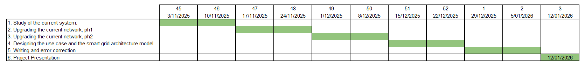

# SmartGrids - Project overview

The main idea behind this work, and the assumed role within the project, is to act as an engineering consultant analyzing and planning the future development of the Catalan high-voltage power network.

The study focuses on a 110 kV transmission system (illustrated below) that supplies four major distribution areas corresponding to the cities of Lleida, Tàrrega, Manresa, and Montblanc.

In recent years, the network has faced increasing challenges due to rising electricity demand and the decommissioning of the Igualada coal plant, carried out as part of CO₂ reduction policies. Currently, the Vandellòs nuclear power plant remains the only active generation source in the region, which is insufficient to cover total demand. As a result, a considerable share of the required power must be imported through the Terrassa interconnection.

he project was divided into several stages, each designed to progressively analyze, optimize, and modernize the 110 kV transmission network under study.

The first stage focused on understanding the current operation of the system, by modelling both demand and generation profiles for a typical weekday using real data from the Spanish TSO (REE). These profiles were normalized and implemented in PandaPower to perform a 24-hour load flow study, identifying key technical issues such as voltage deviations, equipment overloads, and insufficient generation capacity. The operating costs were also estimated, including the amount and price of imported energy and the expected failure costs for lines and transformers.

The second stage aimed to upgrade the existing network, introducing new transmission lines and evaluating alternative configurations that could meet reliability and efficiency criteria — such as the N–1 contingency rule, acceptable voltage levels, and limited power losses. The analysis also explored the feasibility of modifying the voltage level of the system, assessing the potential technical and economic impacts of such a change.

In the third stage, several future development scenarios were considered to address the network’s main limitations. These included the integration of renewable energy sources (wind and solar), the deployment of energy storage systems using HVDC technology, and other possible solutions such as compensators, demand response mechanisms, or repurposing decommissioned assets. Each option was evaluated through technical simulations and cost–benefit analyses to determine the most advantageous approach.

Finally, a use case and smart grid architecture model (SGAM) were developed to conceptualize how advanced control and communication technologies could support the transition towards a more flexible, reliable, and sustainable electrical network.

# Topics and Schedule 
## I. Study of the current system:
### a. Data adquisitation
### b. Normalaise demand and generation 
### c. Model the electrical system with PandaPower
### d. Carry out the load flow
### e. Identify the problems of the current system:
- Demand coverage
- Voltage deviations
- Equipment overload
- Interruptibility (for one year)
### f. Estimate the network operating costs for one year
- Compute total amount of energy imported and its cost considering the three time zones
- Compute line and transformer failure costs

## II. Upgrading the current network, phase 1.

## Schedule

# DUDAS:
- Los porfiles tienen que ser de 24h, un solo dia, O de todo el año cada 24h.??
- Ahora vamos desarrollando el proyecto o como?
- Para la generacion, que hacemos? miramos placas o como? como pasamos de hectarias a MW.
- Como definimos que es optimo o no, como hacemos para mejorar la red, en que nos basamos.
- Lo de los escenarios? como va? que hacemos?

